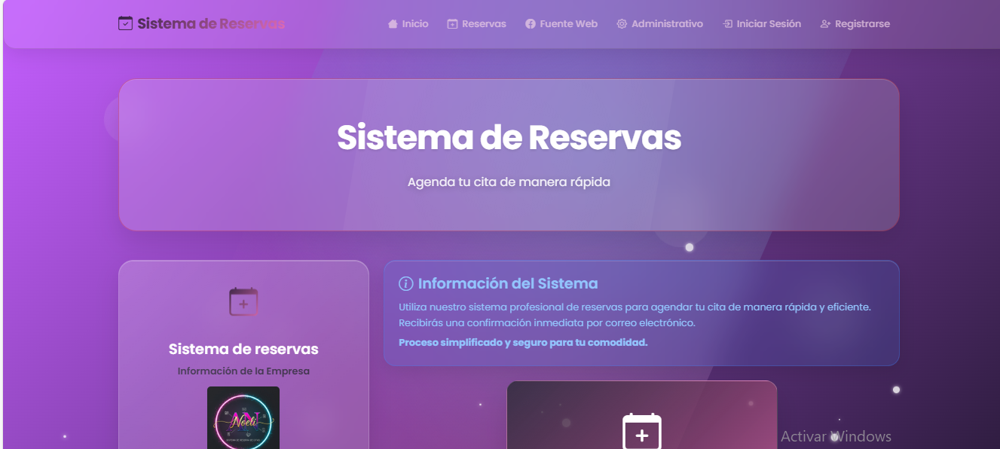
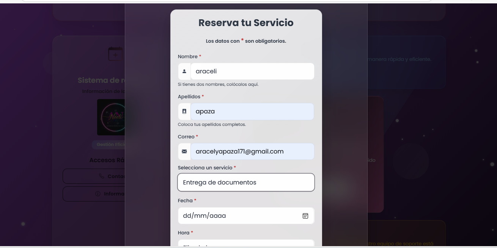
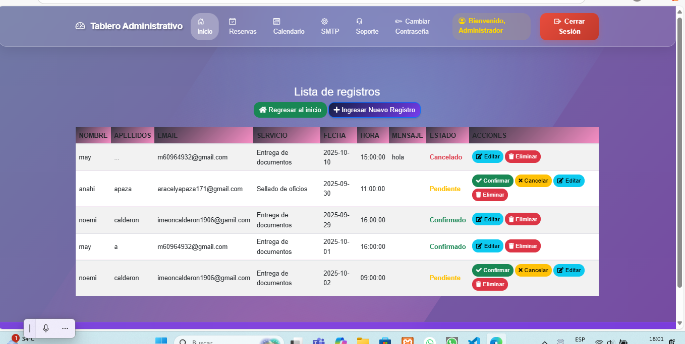

# 📌 Sistema de Reservas

## 🎯 Objetivo del Software

El **Sistema de Reservas** es una plataforma web diseñada para simplificar y automatizar el proceso de agendamiento de citas y servicios. Su objetivo principal es ofrecer a los usuarios una herramienta **rápida y eficiente** para reservar, y proporcionar a los administradores un tablero completo para la gestión, seguimiento y confirmación de todos los registros.

Este sistema busca mejorar la experiencia del cliente y optimizar las operaciones internas al ofrecer:
* **Agendamiento Rápido:** Los usuarios pueden reservar un servicio en pocos pasos y recibir una confirmación inmediata por correo electrónico.
* **Administración Centralizada:** Un panel de control intuitivo para gestionar el estado (Confirmado, Pendiente, Cancelado) de todas las reservas.

---

## 🧠 Tecnologías Utilizadas

Este proyecto fue desarrollado utilizando un stack web que incluye las siguientes tecnologías clave:

* **Frontend:** HTML5, CSS3, y JavaScript (posiblemente un framework moderno como React, Vue.js o Angular).
* **Backend:** Lenguaje de programación enfocado al manejo de la lógica de negocio (ej: PHP, Python/Django, o Node.js/Express).
* **Base de Datos:** Utilizada para el almacenamiento persistente de los datos de usuarios, servicios y registros de reservas (ej: MySQL, PostgreSQL).

---

## ⚙️ Instrucciones de Uso o Prueba

### 1. Interfaz de Usuario (Cliente)

La interfaz principal permite a los usuarios **agendar su servicio**.

**Paso 1: Visualización del Sistema**
La pantalla de inicio ofrece una visión general del sistema y sus funcionalidades.

****

**Paso 2: Reserva del Servicio**
Para agendar, el usuario llena el formulario con sus datos y selecciona el servicio, fecha y hora deseada.

****

### 2. Tablero Administrativo

Esta sección permite la gestión completa de todos los registros.

**Paso 3: Gestión de Registros**
El administrador puede ver la lista completa de reservas y aplicar acciones de gestión como **Confirmar**, **Cancelar**, **Editar** o **Eliminar** cada registro.

****

---

## 👥 Autor o Integrantes
integrantes :Noemi Calderon 
Anahi Araceli Apaza Ance 
## 🌐 Enlace del Despliegue 

El proyecto se encuentra desplegado y accesible en el siguiente enlace:

* **Demo en Vivo:** `[PEGA AQUÍ LA URL DE TU PROYECTO DESPLEGADO]`